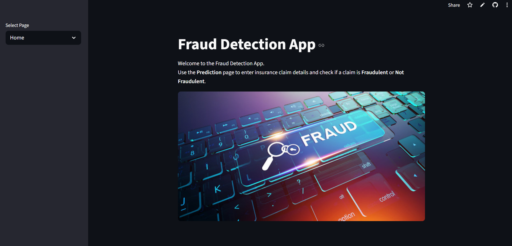
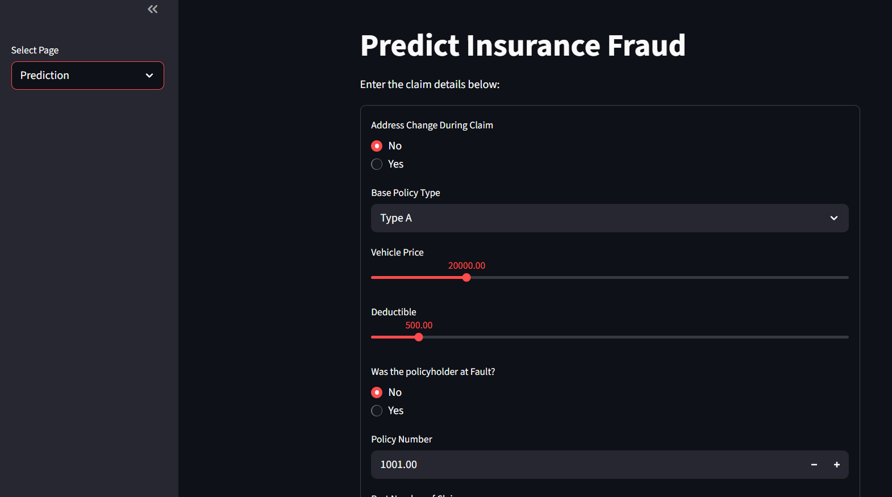

# 🚗 Car Insurance Fraud Claim Detection

A **Machine Learning + FastAPI + Streamlit** based project to detect fraudulent car insurance claims.  
The goal is to help insurance companies quickly identify suspicious claims and reduce financial losses caused by fraud.  

🔗 Try Here: 
---

## 📌 Features
- 🔍 Fraud detection using trained ML models  
- 📊 Preprocessing with **Scaler** and **PCA** for dimensionality reduction  
- ⚡ REST API built with **FastAPI**  
- 🌐 Interactive API docs available at `/docs` (Swagger UI)  
- 🖥️ **Streamlit UI** for user-friendly claim submission and fraud prediction  
- 🗂 Organized backend structure for scalability  

---

## 🏗️ Tech Stack
- **Python 3.10+**  
- **FastAPI** (backend API)  
- **Streamlit** (frontend UI)  
- **Scikit-learn / Pandas / NumPy** (ML pipeline)  
- **Pickle** (store trained model, scaler, PCA, and features)  
- **Uvicorn** (ASGI server for FastAPI)  
- **GitHub** for version control  

---
🖥️ How It Works

User enters claim details in Streamlit form

Data is sent to FastAPI backend

Model predicts claim as:

✅ Not Fraudulent

❌ Fraudulent

---
🛠️ API Endpoints
The project uses FastAPI as the backend for model inference.

| Method | Endpoint  | Description                      |
|--------|-----------|----------------------------------|
| POST   | /predict  | Predict if a claim is fraudulent |
| GET    | /health   | Check API health/status           |


## ⚙️ Local Setup Instructions

Follow these steps to set up and run the project on your local machine:

```bash
# 1️⃣ Clone the repository
git clone https://github.com/lovelessbhartal12/fraud-detect.git
cd fraud-detect

# 2️⃣ Create and activate a virtual environment
python -m venv myenv
myenv\Scripts\activate       # For Windows
source myenv/bin/activate    # For Mac/Linux

# 3️⃣ Install all dependencies
pip install -r requirements.txt

# 4️⃣ Run FastAPI backend (in one terminal)
cd main
uvicorn app:app --reload
# Open in browser: http://127.0.0.1:8000/docs
```
🎨 Streamlit UI

Simple form-based UI for claim data entry

Sends data to backend for fraud prediction

Displays results with labels: Fraudulent Claim / Not Fraudulent

📊 Model Training

 - **Dataset: Car insurance claim records**  

 - **Preprocessing: Missing value handling, categorical encoding, scaling** 

 - **Dimensionality Reduction: PCA**  

- **Classifier: (e.g., Decesion tree, ensemble)**

 - **Evaluation Metrics: Accuracy, Precision, Recall, F1-score**
   
📸 Streamlit App Screenshot
 
 

📄 License

This project is licensed under the MIT License. See the LICENSE file for details.
---

## 👨‍💻 Made By

This project was lovingly crafted by **Loblesh Bhartal** 💡🛠️✨  

Thank you for checking out my work! 🚀🔥
